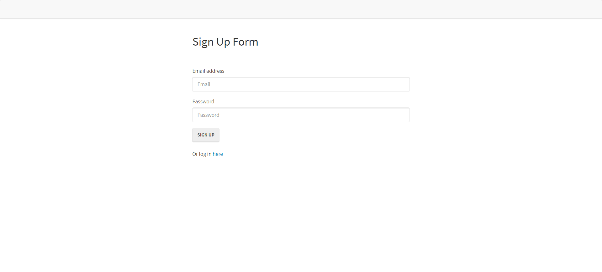
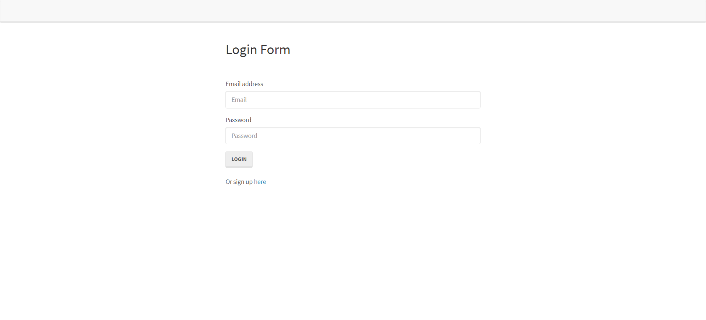
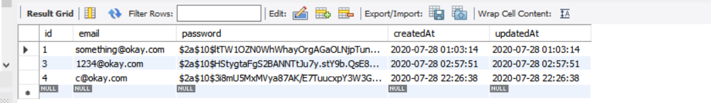
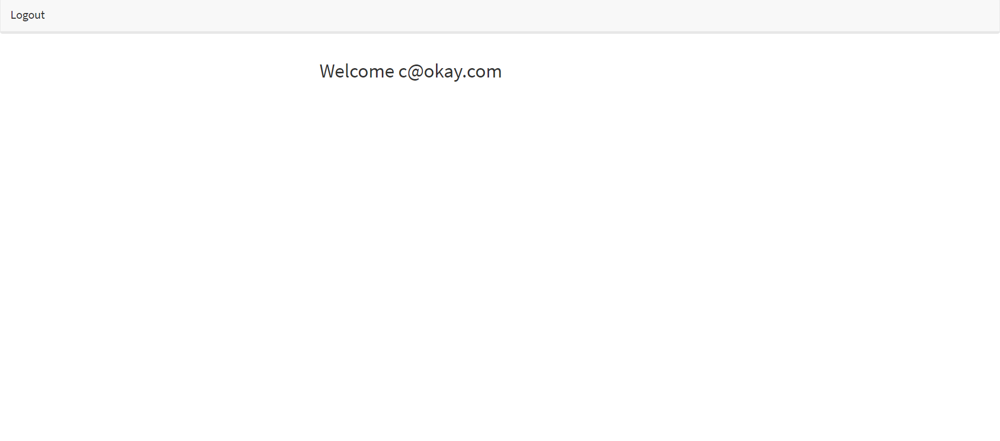

# Reverse Engineering Code

## Description
The objective of this project is to reverse engineer the the starter code and write a tutorial explaining each file and its purpose. The end of the tutorial should also include instructions on how to add changes to this project.

Below is the acceptance criteria:
```md
GIVEN a Node.js application using Sequelize and Passport
WHEN I follow the walkthrough
THEN I understand the codebase
```

## Table of Contents
* [Introduction](#introduction)
* [Tutorial](#tutorial)
* [Authors](#authors)

## Introduction
This application is a demo for how to implement/use passport and other node modules to setup local user authentication through a username and password. Users can sign-up, login, and visit a members page. After leaving the site, users can return and automatically go directly to the members page.




## Tutorial

The below tutorial is organized by file. For each file, we explain the key components/functionality of the file as well as any dependencies.

### server.js

The server.js file contains the scripts to run/start the server. It requires necessary npm packages, modules, and routes for the application to run correctly. As we are running an express server, this application requires express and express-session, which will be used for creating cookies to keep track of the user's login status.

Within the server.js file, there are also several instances of middleware performing various functions. Some middleware is used to make sense of incoming request objects while others point to where are static assets are located. Middleware is also included for initializing npm packages such as passport.

This file also is utilizing sequelize to sync our database (i.e. with our models) and sets up the server to "listen" on the specified PORT. PORT is setup to run on environments such as Heroku or to run on a specific local port if there is no environment port.

### models - index.js

The index.js file is initialized by sequilize along with the config.json file. This file is used in strict mode and is setup so that we can use sequelize to create models, connect to MySQL, execute queries, etc.

### models - user.js

This file helps us create our tables. Here, we define our 'users' table with our desired columns. We also specify validations, as illustrated below:
```
var User = sequelize.define("User", {
    // The email cannot be null, and must be a proper email before creation
    email: {  //column of email
      type: DataTypes.STRING, //string
      allowNull: false, //cannot be null
      unique: true, //must be unique
      validate: {
        isEmail: true //validation check for email format
      }
    },
```
This file also contains code to hash the user's password and to perform a comparison between the password entered by the user and the hashed password stored in our database. This is done using the bcryptjs package. Below is the code:
```
User.prototype.validPassword = function(password) { //object prototype "validPassword"
    return bcrypt.compareSync(password, this.password); //compares the hashed password in our database with the entered password 
  };
  // Hooks are automatic methods that run during various phases of the User Model lifecycle
  // In this case, before a User is created, we will automatically hash their password
  User.addHook("beforeCreate", function(user) {
    user.password = bcrypt.hashSync(user.password, bcrypt.genSaltSync(10), null); //hashing replaces password values with jumbled characters
  });
  return User;

```


This model file is used by the controller (api-routes) to make queries to our database.

### Routes - api-routes.js
The api-routes files contains all of our routes that are connecting with our database. The file requires our models and the passport package for authentication purposes.

The first route shown is for when users attempt to login:
```
  app.post("/api/login", passport.authenticate("local"), function(req, res) { //post route where request is sent to /api/login. passport.authenticate is middleware for passport used in express - setting to local strategy.
    res.json(req.user); //json data not actually used - members page redirect occurs (check login.js) as long as the post route is successful 
  });
```
As mentioned in the comments above, this request is for authenticating the user and his/her password. The response to the request is not actually used as the redirect handled in the login.js file does not require any inputs.

The second route is for signing up a new user:
```
  app.post("/api/signup", function(req, res) {
    db.User.create({ //using the User model and sequelize create (i.e. INSERT INTO) to add an entry into the db
      email: req.body.email, //email key in the object
      password: req.body.password //password key in the object
    })
      .then(function() {
        res.redirect(307, "/api/login"); //temporary redirect "resource has moved to new URL". Method and body are not changed when redirect occurs.
      })
      .catch(function(err) {
        res.status(401).json(err); //unauthorized
      });
  });
```
The above code uses the User model and sequelize to insert a new row into our 'users' table. 

The third route is for logging the user out. It utilizes a passport function to remove the req.user property and clears the login session:

```
  app.get("/logout", function(req, res) {
    req.logout(); //passport function that removes the req.user property and clears the login session (if any).
    res.redirect("/"); //redirects to root route
  });
```

The final route is for displaying the user's email on the member's page after sign-in:
```
app.get("/api/user_data", function(req, res) {
    if (!req.user) {
      // The user is not logged in, send back an empty object
      res.json({});
    } else {
      // Otherwise send back the user's email and id
      // Sending back a password, even a hashed password, isn't a good idea
      res.json({
        email: req.user.email,
        id: req.user.id
      });
    }
  });
```


### Routes - html-routes.js
This file contains the routes for redirecting users to different HTML pages depending on if they are already a user, logged-in, etc. 
This file requires a custom middleware in the config folder that retricts the routes a user can access if they are note loggied in.

### Config - passport.js
This file houses the configuration strategy for passport, in this case, local (for authenticating locally with username and password). This is where we also export the passport module.

### Public folder
This folder contains all of the static assets that are 'public' to the client. The HTML files are kept here and sent to the client-side as dictacted by the html-routes.js controller. Each HTML file contains elements with classes and ids that are then used by corresponding js files, also located in the public folder, to make ajax requests, such as the login below:

```
  // When the form is submitted, we validate there's an email and password entered
  loginForm.on("submit", function(event) {
    event.preventDefault(); //prevents form from auto submitting on page rendering
    var userData = {
      email: emailInput.val().trim(), //captures email value and trims spaces
      password: passwordInput.val().trim() //captures password value and trims spaces
    };

    if (!userData.email || !userData.password) { //if there is no email or password return (empty)
      return;
    }

    // If we have an email and password we run the loginUser function and clear the form
    loginUser(userData.email, userData.password);
    emailInput.val("");
    passwordInput.val("");
  });

  // loginUser does a post to our "api/login" route and if successful, redirects us the the members page
  function loginUser(email, password) { //ajax request sending object with email and password keys and respective values
    $.post("/api/login", {
      email: email,
      password: password
    })
      .then(function() {
        window.location.replace("/members"); //redirects to /members if successful
        // If there's an error, log the error
      })
      .catch(function(err) {
        console.log(err);
      });
  }
});
```
As you can see above, once the user enters his/her info and clicks on submit, values are captured and, if criteria is met, an ajax call is made sending this information to the server an an object. The server, through api-routes, receives the request and makes a query to the database using sequelize. If successful, it responds to the client and the user is redirected to the members page, so long as there is no error.

### Usage example - signup

[Video](https://drive.google.com/file/d/1tPpLHFdf1v9VJpU72Mb_3hUtqDPwybLW/view)

### Usage example - login

[Video](https://drive.google.com/file/d/171c0sgElS6ni0HI-9cWNElh57LFE7wcr/view)


## Authors

* **CHRISTOPHER LEE** 

- [Link to Github](https://github.com/CofChips)
- [Link to LinkedIn](https://www.linkedin.com/in/christophernlee/)
